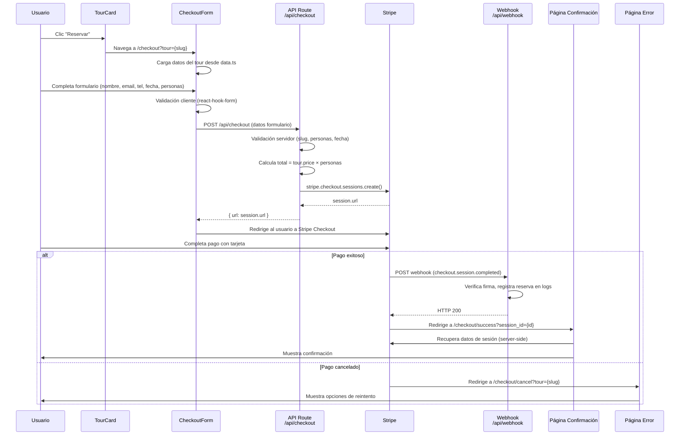

# Documento de Diseño – Pasarela de Pagos

## Resumen

Este documento describe el diseño técnico para integrar una pasarela de pagos con Stripe en Fantasy Travels. El flujo permite a los usuarios seleccionar un tour, completar un formulario de checkout con datos de reserva, pagar mediante Stripe Checkout (hosted), y recibir confirmación o manejo de errores. La arquitectura aprovecha Next.js 14 App Router con Route Handlers para la lógica de servidor, Stripe Checkout Sessions para el procesamiento seguro de pagos, y webhooks para la confirmación asíncrona.

### Decisiones clave de diseño

1. **Stripe Checkout (hosted)** en lugar de Stripe Elements embebido: Stripe gestiona la página de pago, lo que simplifica el cumplimiento PCI-DSS y reduce la superficie de código del cliente. El usuario es redirigido a Stripe y vuelve a la app tras el pago.
2. **Sin base de datos**: En esta fase, las reservas se registran en logs del servidor vía webhook. No se persiste en base de datos para mantener la simplicidad.
3. **Validación dual**: Los datos se validan tanto en el cliente (react-hook-form) como en el servidor (API Route) para garantizar integridad.
4. **Cálculo de precio en servidor**: El total se calcula en el servidor usando los datos de `data.ts` para evitar manipulación del precio desde el cliente.

## Arquitectura

### Diagrama de flujo



### Estructura de archivos nuevos

```
mi-web-turismo/src/
├── app/
│   ├── api/
│   │   ├── checkout/
│   │   │   └── route.ts          # POST: crea Stripe Checkout Session
│   │   └── webhook/
│   │       └── route.ts          # POST: procesa webhooks de Stripe
│   └── checkout/
│       ├── page.tsx              # Formulario de checkout
│       ├── success/
│       │   └── page.tsx          # Página de confirmación
│       └── cancel/
│           └── page.tsx          # Página de error/cancelación
├── components/
│   ├── CheckoutForm.tsx          # Componente formulario de checkout
│   └── OrderSummary.tsx          # Componente resumen de orden
└── lib/
    ├── stripe.ts                 # Instancia de Stripe server-side
    ├── validators.ts             # Funciones de validación compartidas
    └── checkout-utils.ts         # Utilidades de cálculo de precios
```

## Componentes e Interfaces

### 1. TourCard (modificación)

El botón "Reservar" cambia su destino de `/contacto?tour={slug}` a `/checkout?tour={slug}`.

```typescript
// Cambio en TourCard.tsx
<Link href={`/checkout?tour=${tour.slug}`} ...>
  Reservar →
</Link>
```

### 2. CheckoutForm (nuevo componente cliente)

```typescript
interface CheckoutFormProps {
  tour: Tour;
}

interface CheckoutFormData {
  fullName: string;      // Nombre completo
  email: string;         // Email válido
  phone: string;         // Teléfono
  tourDate: string;      // Fecha futura (YYYY-MM-DD)
  numberOfPeople: number; // 1-20
}
```

Responsabilidades:
- Renderiza campos del formulario con react-hook-form
- Valida en cliente: campos requeridos, formato email, fecha futura, rango personas 1-20
- Muestra mensajes de error i18n junto a cada campo
- Envía POST a `/api/checkout` con los datos validados
- Muestra spinner y deshabilita botón durante el envío
- Redirige al usuario a la URL de Stripe Checkout recibida

### 3. OrderSummary (nuevo componente cliente)

```typescript
interface OrderSummaryProps {
  tourTitle: string;
  tourImage: string;
  unitPrice: number;
  numberOfPeople: number;
}
```

Responsabilidades:
- Muestra nombre del tour, imagen, precio unitario
- Calcula y muestra total = unitPrice × numberOfPeople
- Se actualiza reactivamente cuando cambia numberOfPeople
- Muestra precios en formato USD ($XX.XX)

### 4. API Route: POST /api/checkout (Route Handler)

```typescript
// Entrada esperada (body JSON)
interface CheckoutRequest {
  tourSlug: string;
  fullName: string;
  email: string;
  phone: string;
  tourDate: string;
  numberOfPeople: number;
}

// Respuesta exitosa
interface CheckoutResponse {
  url: string; // URL de Stripe Checkout
}

// Respuesta de error
interface CheckoutErrorResponse {
  error: string;
}
```

Responsabilidades:
- Valida que `tourSlug` corresponde a un tour existente en `data.ts`
- Valida `numberOfPeople` entre 1 y 20
- Valida formato de fecha y que sea futura
- Sanitiza inputs (trim, escape caracteres especiales)
- Calcula `total = tour.price × numberOfPeople` (en centavos para Stripe)
- Crea `stripe.checkout.sessions.create()` con:
  - `line_items`: producto con nombre del tour, precio unitario, cantidad = numberOfPeople
  - `mode: 'payment'`
  - `currency: 'usd'`
  - `success_url`: `/checkout/success?session_id={CHECKOUT_SESSION_ID}`
  - `cancel_url`: `/checkout/cancel?tour={tourSlug}`
  - `metadata`: tourSlug, fullName, email, phone, tourDate, numberOfPeople
- Retorna `{ url: session.url }` o error HTTP 500

### 5. API Route: POST /api/webhook (Route Handler)

```typescript
// Sin interfaz de entrada definida — el body es raw (Buffer) para verificación de firma
```

Responsabilidades:
- Lee el body como raw buffer (no JSON parsed)
- Verifica la firma del evento con `stripe.webhooks.constructEvent()`
- Si la firma es inválida: retorna HTTP 400 y registra en logs
- Si el evento es `checkout.session.completed`:
  - Extrae metadata de la sesión
  - Registra la reserva completada en logs del servidor
  - Implementa idempotencia: ignora eventos con ID duplicado (Set en memoria)
- Retorna HTTP 200 para confirmar recepción

### 6. Página /checkout (Server Component wrapper + Client Component)

La página `/checkout/page.tsx` es un Server Component que:
- Lee el query param `tour` de la URL
- Busca el tour en `data.ts`
- Si no existe, redirige a `/tours`
- Si existe, renderiza `<CheckoutForm tour={tour} />`

### 7. Página /checkout/success

- Recibe `session_id` como query param
- Recupera datos de la sesión de Stripe server-side
- Muestra resumen: tour, fecha, personas, total pagado
- Muestra enlace WhatsApp y botón "Volver al inicio"
- Contenido i18n

### 8. Página /checkout/cancel

- Recibe `tour` (slug) como query param
- Muestra mensaje de cancelación
- Botón para reintentar (vuelve a `/checkout?tour={slug}`)
- Enlace WhatsApp como alternativa
- Contenido i18n


### 9. Módulo lib/stripe.ts

```typescript
import Stripe from 'stripe';

export const stripe = new Stripe(process.env.STRIPE_SECRET_KEY!, {
  apiVersion: '2024-04-10',
  typescript: true,
});
```

Singleton de Stripe inicializado con la clave secreta del servidor. Solo se importa en Route Handlers y Server Components.

### 10. Módulo lib/validators.ts

```typescript
interface ValidationResult {
  valid: boolean;
  errors: Record<string, string>;
}

function validateCheckoutData(data: CheckoutRequest): ValidationResult;
function sanitizeString(input: string): string;
function isValidFutureDate(dateStr: string): boolean;
function isValidEmail(email: string): boolean;
function isValidNumberOfPeople(n: number): boolean;
```

Funciones de validación puras, reutilizables entre cliente y servidor. Permiten validación dual consistente.

### 11. Módulo lib/checkout-utils.ts

```typescript
function calculateTotal(unitPrice: number, numberOfPeople: number): number;
function formatPriceUSD(cents: number): string;
function findTourBySlug(slug: string): Tour | undefined;
```

Utilidades puras para cálculo de precios y búsqueda de tours.

## Modelos de Datos

### Tour (existente en data.ts)

```typescript
interface Tour {
  id: number;
  slug: string;
  title: string;
  category: string;
  duration: string;
  price: number;       // Precio base en USD (ej: 179.99)
  maxPrice: number;
  rating: number;
  reviews: number;
  image: string;
  description: string;
  destino: string;
  badge: string | null;
  startTimes: string;
}
```

### CheckoutFormData (nuevo)

```typescript
interface CheckoutFormData {
  fullName: string;
  email: string;
  phone: string;
  tourDate: string;       // ISO date string YYYY-MM-DD
  numberOfPeople: number; // 1-20
}
```

### Stripe Checkout Session Metadata

```typescript
// Almacenado en session.metadata
interface BookingMetadata {
  tour_slug: string;
  customer_name: string;
  customer_email: string;
  customer_phone: string;
  tour_date: string;
  number_of_people: string; // Stripe metadata solo acepta strings
}
```

### Variables de entorno requeridas

```
STRIPE_SECRET_KEY=sk_test_...          # Clave secreta (solo servidor)
NEXT_PUBLIC_STRIPE_PUBLISHABLE_KEY=pk_test_...  # Clave pública (cliente)
STRIPE_WEBHOOK_SECRET=whsec_...        # Secreto para verificar webhooks
```

### Flujo de datos del precio

```
data.ts (tour.price: 179.99 USD)
    ↓
API Route calcula: 179.99 × numberOfPeople = total en USD
    ↓
Convierte a centavos: Math.round(total * 100) = unit_amount para Stripe
    ↓
Stripe Checkout muestra el total al usuario
    ↓
Webhook confirma el monto pagado (session.amount_total en centavos)
```

### Internacionalización (i18n)

Se añaden nuevas claves a `es.json` y `en.json`:

```typescript
// Nuevas claves en messages
{
  "checkout": {
    "title": "Completa tu reserva",
    "fullName": "Nombre completo",
    "email": "Email",
    "phone": "Teléfono / WhatsApp",
    "date": "Fecha del tour",
    "people": "Número de personas",
    "submit": "Pagar ahora",
    "processing": "Procesando...",
    "summary": "Resumen de tu orden",
    "unitPrice": "Precio por persona",
    "total": "Total",
    "errors": {
      "required": "Campo requerido",
      "invalidEmail": "Formato de email inválido",
      "futureDate": "La fecha debe ser futura",
      "peoplRange": "Entre 1 y 20 personas"
    }
  },
  "success": {
    "title": "¡Reserva confirmada!",
    "message": "Tu pago fue procesado exitosamente.",
    "whatsapp": "Contactar por WhatsApp",
    "home": "Volver al inicio"
  },
  "cancel": {
    "title": "Pago cancelado",
    "message": "Tu pago fue cancelado. Puedes intentar de nuevo.",
    "retry": "Intentar de nuevo",
    "whatsapp": "Reservar por WhatsApp"
  }
}
```


## Propiedades de Correctitud

*Una propiedad es una característica o comportamiento que debe mantenerse verdadero en todas las ejecuciones válidas de un sistema — esencialmente, una declaración formal sobre lo que el sistema debe hacer. Las propiedades sirven como puente entre especificaciones legibles por humanos y garantías de correctitud verificables por máquinas.*

### Propiedad 1: La validación rechaza datos de checkout inválidos

*Para cualquier* conjunto de datos de checkout donde al menos un campo requerido esté vacío, o el email tenga formato inválido, o la fecha no sea futura, o el número de personas esté fuera del rango 1-20, o el tour_slug no corresponda a un tour existente, `validateCheckoutData` SHALL retornar `valid: false` con al menos un error específico en el campo correspondiente.

**Valida: Requisitos 2.1, 2.2, 2.3, 2.4, 2.6, 4.4, 4.5**

### Propiedad 2: Invariante de cálculo de total

*Para cualquier* precio unitario positivo y número de personas entre 1 y 20, `calculateTotal(unitPrice, numberOfPeople)` SHALL retornar exactamente `unitPrice * numberOfPeople`, manteniendo la invariante `total === unitPrice × numberOfPeople`.

**Valida: Requisitos 2.5, 3.4**

### Propiedad 3: Formato de precio USD consistente

*Para cualquier* monto numérico no negativo, `formatPriceUSD(amount)` SHALL retornar un string que comience con "$", contenga exactamente dos decimales, y cuyo valor numérico sea equivalente al monto original.

**Valida: Requisito 3.2**

### Propiedad 4: La sesión de Stripe contiene monto y metadata correctos

*Para cualquier* datos de checkout válidos (tour existente, personas 1-20, fecha futura), la sesión de Stripe creada SHALL tener `amount_total` igual a `Math.round(tour.price * numberOfPeople * 100)` centavos, moneda "usd", y metadata conteniendo todos los campos requeridos: tour_slug, customer_name, customer_email, customer_phone, tour_date, number_of_people.

**Valida: Requisitos 4.1, 4.6**

### Propiedad 5: Idempotencia del procesamiento de webhooks

*Para cualquier* evento de webhook con un ID dado, procesarlo N veces (N ≥ 1) SHALL producir el mismo resultado que procesarlo exactamente 1 vez. El segundo y subsiguientes procesamientos del mismo event_id SHALL ser ignorados y retornar HTTP 200.

**Valida: Requisito 5.4**

### Propiedad 6: La sanitización elimina contenido peligroso sin alterar texto seguro

*Para cualquier* string de entrada, `sanitizeString(input)` SHALL retornar un string que no contenga tags HTML (`<script>`, ``, etc.) ni caracteres de control. Además, *para cualquier* string alfanumérico puro (sin caracteres especiales), `sanitizeString(input).trim()` SHALL ser igual al `input.trim()` original.

**Valida: Requisito 8.3**

## Manejo de Errores

### Errores del cliente (CheckoutForm)

| Escenario | Comportamiento |
|-----------|---------------|
| Campo requerido vacío | Mensaje de error rojo bajo el campo específico |
| Email formato inválido | "Formato de email inválido" bajo el campo email |
| Fecha pasada | "La fecha debe ser futura" bajo el campo fecha |
| Personas fuera de rango | "Entre 1 y 20 personas" bajo el campo personas |
| Error de red al enviar | Toast/mensaje general "Error de conexión. Intenta de nuevo." |
| Stripe redirige con error | Página /checkout/cancel con opciones de reintento |

### Errores del servidor (API Routes)

| Escenario | Código HTTP | Respuesta |
|-----------|------------|-----------|
| Tour slug no encontrado | 400 | `{ error: "Tour no encontrado" }` |
| Datos de validación inválidos | 400 | `{ error: "Datos inválidos", details: {...} }` |
| Fallo al crear sesión Stripe | 500 | `{ error: "Error al procesar el pago" }` |
| Firma webhook inválida | 400 | Log del intento + respuesta vacía |
| Evento webhook duplicado | 200 | Ignorado silenciosamente |
| Error interno webhook | 500 | Log del error + respuesta vacía |

### Estrategia de reintentos

- El cliente puede reintentar el envío del formulario sin límite
- El botón se deshabilita durante el procesamiento para evitar envíos duplicados
- La página de cancelación ofrece reintento directo y WhatsApp como alternativa
- Los webhooks de Stripe se reintentan automáticamente por Stripe si no reciben HTTP 200

## Estrategia de Testing

### Tests unitarios (ejemplo-based)

Tests específicos para verificar comportamientos concretos:

- **CheckoutForm**: Renderiza campos correctos, muestra errores de validación, deshabilita botón durante envío
- **OrderSummary**: Muestra datos del tour, actualiza total reactivamente
- **Página success**: Muestra resumen de reserva, enlace WhatsApp, botón inicio
- **Página cancel**: Muestra mensaje cancelación, botón reintento, enlace WhatsApp
- **API /api/checkout**: Retorna URL de Stripe con datos válidos, retorna 400/500 con datos inválidos
- **API /api/webhook**: Procesa evento válido, rechaza firma inválida (HTTP 400)
- **i18n**: Todas las claves de checkout/success/cancel existen en es.json y en.json

### Tests de propiedades (property-based)

Librería: **fast-check** (compatible con TypeScript y el ecosistema Node.js/Next.js)

Cada test de propiedad debe ejecutar mínimo 100 iteraciones y estar etiquetado con referencia al documento de diseño.

| Propiedad | Función bajo test | Generadores |
|-----------|------------------|-------------|
| 1: Validación rechaza inválidos | `validateCheckoutData` | Datos de checkout con campos inválidos aleatorios |
| 2: Invariante de total | `calculateTotal` | Precios float positivos, personas 1-20 |
| 3: Formato USD | `formatPriceUSD` | Montos float no negativos |
| 4: Sesión Stripe correcta | `createCheckoutSession` (con mock) | Datos de checkout válidos aleatorios |
| 5: Idempotencia webhook | `processWebhookEvent` | IDs de evento aleatorios, procesados N veces |
| 6: Sanitización | `sanitizeString` | Strings aleatorios con HTML/scripts + strings alfanuméricos puros |

Formato de etiqueta: `Feature: pasarela-de-pagos, Property {N}: {descripción}`

### Tests de integración

- Flujo completo checkout → Stripe mock → webhook → confirmación
- Verificación de variables de entorno (claves no expuestas al cliente)

### Dependencias de testing

```json
{
  "devDependencies": {
    "fast-check": "^3.15.0",
    "@testing-library/react": "^14.0.0",
    "@testing-library/jest-dom": "^6.0.0",
    "jest": "^29.0.0",
    "@types/jest": "^29.0.0",
    "ts-jest": "^29.0.0"
  }
}
```
